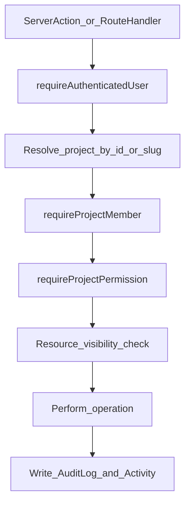

# Phase 0 — Discovery & Architecture

## Discovery result

Workspace is **empty** (no files, no git, no package manager, no Next.js). Everything is built from scratch. No existing code to preserve.

## Phase 0 deliverable

Create **[`ARCHITECTURE.md`](ARCHITECTURE.md)** at the repo root (plus a minimal [`README.md`](README.md) pointing to it). **No application scaffolding in Phase 0** — Phase 1 starts only after this architecture is accepted and Phase 0 is marked complete.

---

## Locked technology decisions

| Concern         | Choice                                                                                                                                 |
| --------------- | -------------------------------------------------------------------------------------------------------------------------------------- |
| Package manager | **pnpm**                                                                                                                               |
| Framework       | **Next.js** (App Router) + **TypeScript** + **Node 24 LTS**                                                                            |
| UI              | **Tailwind CSS** + **shadcn/ui**                                                                                                       |
| DB              | **MongoDB** via **Prisma** (`provider = "mongodb"`, `DATABASE_URL`)                                                                    |
| Auth            | **Auth.js (NextAuth v5)** — email/password (Credentials) + invitation acceptance; sessions in DB; recovery/verification via **Resend** |
| Validation      | **Zod** (server + client); forms with **React Hook Form**                                                                              |
| Charts          | **Recharts**                                                                                                                           |
| Files           | **Cloudinary** — server-signed upload + private/authenticated delivery; short-lived signed URLs after authz                            |
| Money           | **Integer minor units** (paise for INR); never JS floats                                                                               |
| Dates           | UTC in DB; display default **Asia/Kolkata** via shared formatters                                                                      |
| Production      | **Docker** + **Nginx** reverse proxy (Phase 14); Atlas/replica-set compatible                                                          |

---

## Target source layout

```text
src/
  app/                    # App Router (auth, (app)/[projectSlug]/...)
  components/             # UI only; no business rules
  config/env.ts           # Zod-validated env; fail-fast in production
  lib/                    # shared utils (money, dates, currency en-IN)
  server/
    auth/                 # Auth.js config, session helpers
    authorization/        # requireAuthenticatedUser, requireProjectPermission, canView*
    db/                   # Prisma client singleton
    projects/
    finance/              # transactions, accounts, categories, budgets, numbering
    advances/
    payments/             # payment requests + linking
    documents/            # Cloudinary + versioning + access
    audit/
    notifications/
    activity/
  validators/
  types/
prisma/schema.prisma
prisma/seed.ts
```

Business logic lives under `src/server/*`. UI never decides authorization.

---

## Multi-project & authorization model



- Every project-scoped resource carries `projectId`.
- Membership is via `ProjectMember` (`userId` + `projectId` + `role` + `status`).
- **Roles** (OWNER, ADMIN, ENGINEER, …) map to **permission sets**; APIs check **permissions**, not role names alone.
- Visibility: `PRIVATE` | `PROJECT_SHARED` | `RESTRICTED` — enforced server-side on read, totals, reports, exports, and document URLs.
- Private personal expenses are excluded from shared project accounting and collaborator dashboards.

Default permission matrix (seeded, editable later in settings):

- **OWNER/ADMIN**: full project + finance + members + audit
- **ENGINEER**: `PROJECT_VIEW`, shared `FINANCE_VIEW`, `PAYMENT_REQUEST_CREATE`, `DOCUMENT_UPLOAD`/`VIEW` (shared), `TASK_*` as assigned, advance settlement submit — **no** private finance, **no** member admin, **no** hard delete of financial history
- **VIEWER**: read shared surfaces only

---

## Database strategy (MongoDB + Prisma)

- ObjectId `@id @default(auto()) @map("_id") @db.ObjectId` on all models.
- References via ObjectId fields; embed only for small immutable snapshots (e.g. audit `diff` metadata, restricted ACL user id lists).
- Soft delete on financial entities: `deletedAt`, `deletedBy`, `deletionReason` — never hard-delete money records.
- Documents: archive semantics (`status: ARCHIVED`) + version history collection.
- Human numbers (`KIL-EXP-000001`) via per-project counters — **not** primary keys.
- Indexes aligned to query patterns (membership, transactions by date/status/category, payment requests by status, documents by category/createdAt, audit by project+time, etc.).

Core collections (conceptual): User, Account (Auth.js), Session, VerificationToken, Project, ProjectMember, RolePermission (or embedded role→permission map), Invitation, FinancialAccount, Category, FinancialTransaction, TransactionAllocation, PaymentRequest, Advance, AdvanceSettlement, Budget, BudgetCategory, Document, DocumentVersion, DocumentAccess, Task, Milestone, Comment, Notification, NotificationPreference, AuditLog, Activity, ProjectCounter.

**Money fields**: `Int` (or `BigInt` if needed) in minor units; currency code on project/transaction.

**Advance outstanding** (server-only):

`outstanding = originalAmount - sum(settlements) - sum(refunds)` — never recomputed ad hoc in the UI.

**Payment request → payment**: explicit `linkedTransactionId`; marking PAID requires a linked transaction; no duplicate silent ledger rows.

---

## Financial correctness rules (documented in ARCHITECTURE.md)

- Paid requires amount + payment date.
- Settlement ≤ outstanding advance.
- Refund ≤ refundable original.
- Cross-project IDs rejected after membership check.
- Totals/reports aggregate only rows the caller is authorized to see.
- Amount changes write audit diffs (from/to/reason); no silent overwrite of history meaning.

---

## Document & Cloudinary strategy

- Client never receives `CLOUDINARY_API_SECRET`.
- Flow: authz → validate type/size/extension (not MIME alone) → server signed upload params → store metadata + `cloudinaryPublicId` → access via short-lived signed URL after `canDownloadDocument` / `canViewDocument`.
- Version replace creates `DocumentVersion`; restore is authorized admin action + audit.
- Dangerous formats rejected; filenames sanitized; user-supplied public IDs rejected.

---

## Security model (summary for ARCHITECTURE.md)

- Auth.js secure cookies/sessions; CSRF via framework defaults where applicable.
- Zod on every mutation; centralized errors (user-safe message + internal code); no raw DB errors to clients.
- Rate limiting on auth and upload routes (Phase 1 foundation + harden in Phase 13).
- Secrets only in env; [`src/config/env.ts`](src/config/env.ts) validates at startup; [`.env.example`](.env.example) placeholders only.
- Secure headers / CSP practical baseline in Next config + Nginx (Phase 14).

---

## UI / navigation (architecture only)

- Desktop: project-scoped nav (Dashboard, Finance, Payment Requests, Advances, Documents, Tasks, Milestones, Reports, Activity, Members, Settings) + project switcher.
- Mobile: bottom nav (Home, Finance, Documents, Tasks, More) + FAB quick-add (Expense, Income, Payment Request, Advance, Document, Task).
- Design: premium, minimal, construction PM feel; strong type hierarchy; restrained chrome; mobile card lists for finance tables.

---

## Phased delivery after Phase 0

| Phase | Outcome                                                                                     |
| ----- | ------------------------------------------------------------------------------------------- |
| 1     | Next.js + Tailwind + shadcn + env + Prisma/Mongo + auth shell + layout + logging — app runs |
| 2     | Auth complete (login/logout/session/profile/invites foundation)                             |
| 3     | Projects, members, invitations, roles                                                       |
| 4     | Centralized authz + isolation tests                                                         |
| 5–7   | Finance core → Advances → Payment requests                                                  |
| 8–9   | Documents/Cloudinary → Budget                                                               |
| 10–12 | Tasks/milestones → Dashboard → Reports/CSV                                                  |
| 13–15 | Audit/hardening → Docker/Nginx → final QA / acceptance scenario                             |

**Rule:** After each phase — `tsc`, lint, tests, build — fix before advancing. Phase summary format as specified in the brief.

---

## Phase 0 work items (execution after plan approval)

1. Initialize git repository (local only; no remote unless asked).
2. Write [`ARCHITECTURE.md`](ARCHITECTURE.md) covering: architecture overview, module structure, DB strategy + index intent, authz model + role→permission defaults, visibility rules, finance/ledger rules (money, numbering, advances, payment linking), document/Cloudinary strategy, security model, deployment architecture (Docker/Nginx/Atlas), phase map, and acceptance criteria reference.
3. Write a short [`README.md`](README.md) (product name, pointer to architecture, “Phase 0 complete / Phase 1 next”).
4. Stop. Do not scaffold Next.js until Phase 1 is explicitly started.

## Out of scope for Phase 0

Application code, Prisma schema file, Docker, seed data, UI, Cloudinary integration.
